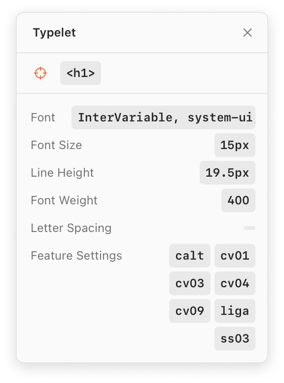

  <h1>Typelet</h1>
  
A bookmarklet for inspecting computed font styles

  
  <picture>
    <source media="(prefers-color-scheme: dark)" srcset="screenshot/dark.png">
    <source media="(prefers-color-scheme: light)" srcset="screenshot/light.png">
    
  </picture>

